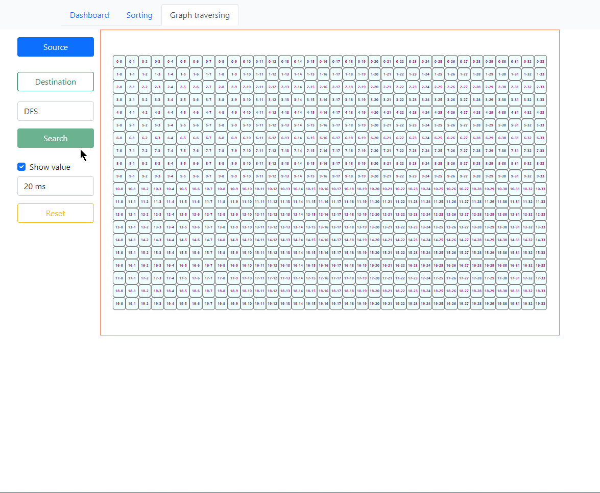
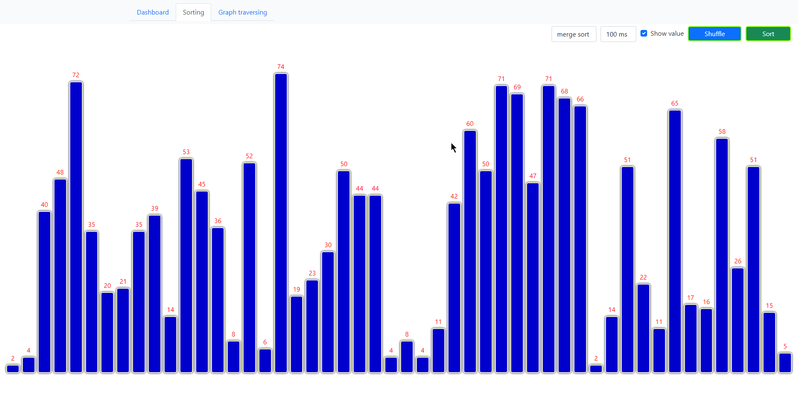
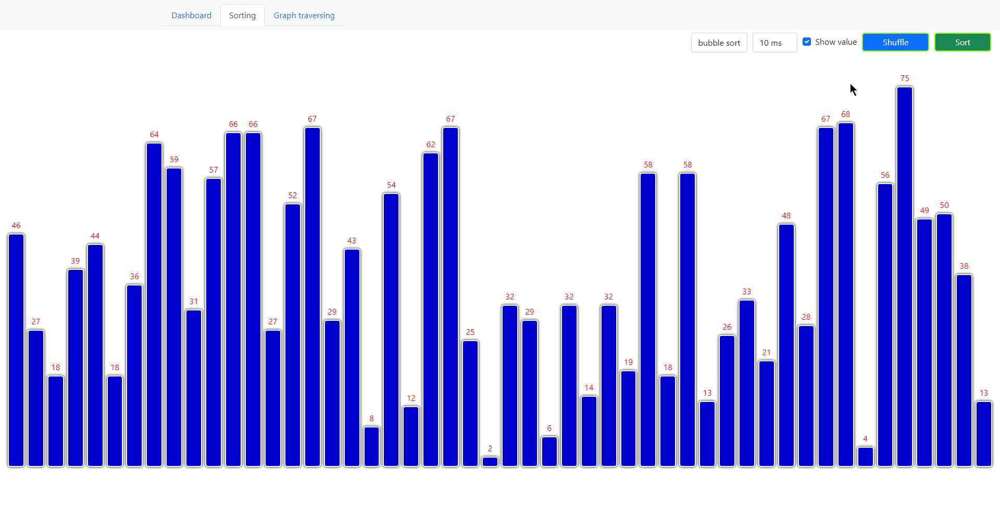

Its a practice project for learning **angular**. Have a look at the .gif file attached below to get a quick demo

# Sort visualizer
* **Bubble sort**
* **Merge sort**

# Graph visualizer
* **BFS**
* **DFS**
* **Used rxjs for complex event handling**.
* Added forbidden cell which is not accessible while traversing.

## BFS

  

## DFS

  

## Merge sort

  

## Bubble sort

  

